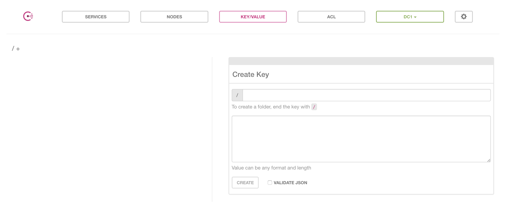
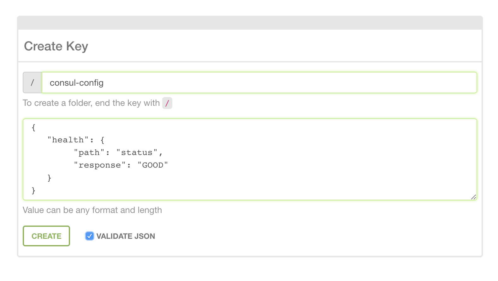

# Dynamic Config

A dynamic configuration library for Node.js written in TypeScript.

Application configuration can be an unnecessarily complicated problem when working in large distributed systems across multiple runtimes. Gaining consensus about what configuration needs to do, what it needs to look like and how it interfaces with a specific runtime can be nearly impossible. Dynamic Config is designed to be highly adaptable to a variety of requirements. It is built on a plugin architecture that allows it to be adapted further. Beyond this, it handles local configuration files in a way consistent with other popular Node config libraries.

### Plugable

Plugins for Dynamic Config provide extensible support for loading local file types, talking to remote data stores and transforming/validating config structures.

#### File Types

Support for config file types is added through plugins. Dynamic Config comes with plugins for `js`, `ts`, `json` and `yaml` files. It is easy to add support for additional file types.

#### Remote Data Sources

Dynamic Config also supports remote data sources through plugins. The included plugins include clients for pulling values from Hashicorp Consul and Vault. The plugin interface is also used for adding support for environment variables and command line arguments.

#### Transformation and Validation

The third kind of plugin is something we call a translator. When raw config values are loaded, either form local files or remote sources, you can use translators to transform or validate the structure of the raw data before it is added to the resolved config object.

### Promise-based

When requesting a value from Dynamic Config a Promise of the expected result is returned. If the value is found the Promise is resolved. If the value is not found, either because it is missing or some other error, the Promise is rejected with an error describing why the value may be missing.

## Table of Contents

- [Getting Started](#getting-started)
- [API Overview](#api-overview)
- [Customizing Your Config Instance](#customizing-your-config-instance)
- [Local Configuration](#default-configuration)
- [Remote Configuration](#remote-configuration)
- [Translators](#translators)
- [Plugin Support](#plugin-support)
- [Roadmap](#roadmap)

---

## Getting Started

As mentioned, Dynamic Config can adapt to a number of different situations, but I think it's important to go through setting up a simple working application. Most use-cases will not require more than this.

We're just going to standup an express server with one route that returns a string, but we are going to configure this application for a number of different environments.

### Make a New Project

```sh
$ mkdir config-example
$ cd config-example
$ npm init
```

I'm also going to be using TypeScript, so we need to set that up.

#### TSCONFIG

My `tsconfig.json` looks like this:

```json
{
    "compilerOptions": {
        "target": "es6",
        "module": "commonjs",
        "rootDir": "./src",
        "outDir": "./dist",
        "noEmitOnError": true,
        "strict": true,
        "noUnusedLocals": true,
        "pretty": true,
        "removeComments": true
    },
    "exclude": [
        "node_modules",
        "dist"
    ]
}
```

#### PACKAGE.JSON

I add a script to `package.json` to run `tsc` for me.

```json
{
    //...
    "scripts": {
        "build": "tsc"
    },
    //...
}
```

### Install

Install Dynamic Config:

```sh
$ npm install --save @creditkarma/dynamic-config
```

We need to install a few other goodies. In the example we are going to use TypeScript.

```sh
$ npm install --save-dev typescript
$ npm install --save express
$ npm install --save @types/express
```

### Create the Default Config

A default config file is required. If you're doing something simple this may be enough. I'm going to create a new directory at my project root called `config`. Inside of this directory I'm going to create one file `default.json`.

```json
{
    "server": {
        "port": 8000,
        "host": "localhost"
    },
    "health": {
        "path": "control",
        "response": "success"
    }
}
```

[More Information](#local-configuration)

### Create an Express Server

I'm going to create one more directory called `src` and in this directory I will add one file `index.ts`.

```typescript
import { config } from '@creditkarma/dynamic-config'
import * as express from 'express'

interface HealthCheckConfig {
    path: string
    response: string
}

(async function startServer() {
    const port: number = await config().get('server.port')
    const healthCheck: HealthCheckConfig = await config().get('health')
    const app: express.Application = express()

    app.get(`/${healthCheck.path}`, (req, res) => {
        res.send(healthCheck.response)
    })

    app.listen(port, () => {
        console.log(`Express server listening on port: ${port}`)
    })
}())
```

That's all we need for the most basic usage of Dynamic Config.

### Running Our Application

Compile TypeScript and run the app:

```sh
$ npm run build
$ node dist/index.js
```

Now you should be able to `curl` the running server:

```sh
$ curl http://localhost:8000/control
```

If all is well this should return "success" as defined in our `config/default.json` file.

### Environment Overrides

One of the main reasons to use a configuration library is to add a layer of abstraction for dealing with environment-specific configuration.

Environmnet-specific configuration files have the same name as the environment they configure. We are going to create a new file for the `development` environment. That means our file must be named "development". Just because we can, instead of `json` we are going to use a `js` file to hold our `development` configuration.

Create a new file called `development.js` in our `config` directory.

```js
module.exports.server = {
    port: 8080
}
```

Now we can run our server in the `development` environment with overrides.

```sh
$ NODE_ENV=development node dist/index.js
```

Now instead of port `8000` we are going to send a request of `8080`.

```sh
$ curl http://localhost:8080/control
```

### Remote Configuration

Things get a little more complex when we talk about pulling in remote configuration and merging it with our local configuration in a seamless way. Dynamic Config supports a plugin API for adding support for remote configuration stores. For this next bit we are going to use Consul running in a Docker container to serve as our remote configuration source.

#### Setting Up Consul with Docker

I am going to use `docker-compose` to configure and run my Consul container. If you don't have `docker` installed locally, you can check out install instructions [here](https://docs.docker.com/compose/install/).

I add a new file at my project root `docker-compose.yml`:

```yml
version: '2'
services:
  consul:
    image: consul:latest
    volumes:
      - $PWD/consuldata:/tmp/consuldata
    ports:
      - "8410:8400"
      - "8510:8500"
      - "8610:8600"
    environment:
      - "CONSUL_LOCAL_CONFIG={\"disable_update_check\": true}"
      - "CONSUL_BIND_INTERFACE=eth0"
    command: "consul agent -dev -client 0.0.0.0 -server -data-dir=/tmp/consuldata -bootstrap-expect=1"
```

Once we have this open a new terminal window and start Consul by typing:

```sh
$ docker-compose up
```

You will see some logging and very soon:

```sh
consul_1  | ==> Consul agent running!
```

Now we're ready to add some values to our Consul data store. There is an HTTP API for adding values to Consul, but for our purposes we are going to use the UI. The Consul UI can be found at `http://localhost:8510/ui/`.

You should see something like this:


Click on the tab `KEY/VALUE`:



This will work like our `development` override. We are going to add a JSON structure that will overlay our local config values. In the top text input we will add the key name `consul-config`. In the larger text box we include a blob of valid JSON (You will notice the built-in JSON validator).

```json
{
    "health": {
        "path": "status",
        "response": "GOOD"
    }
}
```



Click `CREATE` and we are ready to go.


#### Configuring Our Application to Use Consul

In order for Dynamic Config to know about the values we added to Consul we must configure it to know about Consul. We can do this in a few ways. We can add static config in a file called `config-settings.json` at our project root, we can set configuration on environment variables or we can pass in command line arguments to our application. We are going to use command line arguments.

```sh
$ node ./dist/index.js CONSUL_ADDRESS=http://localhost:8510 CONSUL_KV_DC=dc1 CONSUL_KEYS=consul-config
```

The three options we set are (all are required):
* `CONSUL_ADDRESS` - This is the URL on which Consul is running
* `CONSUL_KV_DC` - The Consul data center for the key/value store.
* `CONSUL_KEYS` - These are keys in Consul that contain configs to overlay with our local configs. This can be a comma-separate list of multiple keys. You will notice I add the key we just created in Consul.

Now when we `curl` our running application we can not longer hit `/control` as we have overriden the path in Consul to `/status`.

```sh
$ curl http://localhost:8080/status
```

The response now should be `GOOD`.

#### Using Remote Configuration for a Single Value

In addition to straight overlays of JSON objects, Dynamic Config also supports the notion of a placeholder in your config. Say you have a local config file for production, `production.json`, there is a value(s) that will be set on a per-data-center basis via Consul. For nothing more than arbitrary reasons let's say that such a value is the `port` on which the server will run.

I add a new file `production.json` to `config`:

```json
{
    "server": {
        "port": {
            "_source": "consul",
            "_key": "server-port",
            "_default": 8080,
            "_type": "number"
        }
    }
}
```

Okay, so we know `port` should be a number, but it is going to be set per host via Consul. We call that out by replacing the port number in our config with this placeholder object. When the library finds one of these objects it tries to resolve the value with the remote named by `_source`, `consul` is one of the remotes included by default. The `_key` property is a string which we search the remote for. The `_default` property is optional and provides a value to use in the event one cannot be retrieved from the remote. The `_type` property is also optional and is used to try to validate the value returned from the remote.

Back over to our Consul UI `http://localhost:8510/ui/`. We are going to add the key `server-port`. I set this value to `8090`.


Now, we have a new production config that points to a single value in Consul. Let's try this out. We will need to set `NODE_ENV=production` so we pick up the new local config file.

```sh
$ NODE_ENV=production node ./dist/index.js CONSUL_KV_DC=dc1 CONSUL_ADDRESS=http://localhost:8510 CONSUL_KEYS=consul-config
```

And then test our work with `curl`:

```sh
$ curl http://localhost:8090/status
```

#### Resolution Chain

At this point our config resolution chain is doing quite a lot.

1. Load `default.json` and create the initial configuration object.
2. Load `production.json` and overlay values in the current configuration.
3. Load the key `consul-config` from Consul and overlay values in the current configuration.
4. Recognize the placeholder for `port`, load the key `server-port` from Consul and replace the value in configuration.

This shows us one working flow, but how do we add additional remotes? How do we read envirnoment variables? How do we add file support? Wait, what is even the full API? We will be going through all of this and more in the rest of this document.

[back to top](#table-of-contents)

## API Overview

As we saw in [Getting Started](#getting-started) our `DynamicConfig` object is accessed through a function called `config`. This function is used to lazily create a singleton instance of the underlying `DynamicConfig` class. Subsequent calls to this function return the same instance.

```typescript
import { config } from '@creditkarma/dynamic-config'

export async function createHttpClient(): Promise<Client> {
    const host: string = await config().get<string>('hostName')
    const port: number = await config().get<number>('port')
    return new Client(host, port)
}
```

### Instance Methods

The availabe methods on a config instance are as follows:

#### `get`

Gets the value for a specified key. If the key cannot be found the Promise is rejected with an `Error` describing what went wrong.

```typescript
import { config } from '@creditkarma/dynamic-config'

export async function createHttpClient(): Promise<Client> {
    const host: string = await config().get<string>('host')
    const port: number = await config().get<number>('port')
    return new Client(host, port)
}
```

The key you pass to `get` can reference a nested object. If, for instance, your config looked like this:

```json
{
    "server": {
        "host": "localhost",
        "port": 8080
    }
}
```

You could access values like so:

```typescript
import { config } from '@creditkarma/dynamic-config'

export async function createHttpClient(): Promise<Client> {
    const host: string = await config().get<string>('server.host')
    const port: number = await config().get<number>('server.port')
    return new Client(host, port)
}
```

#### `getWithDefault`

You can also assign a default value in the event that the key cannot be found.

```typescript
import { config } from '@creditkarma/dynamic-config'

export async function createHttpClient(): Promise<Client> {
    const host: string = await config().getWithDefault<string>('host', 'localhost')
    const port: number = await config().getWithDefault<number>('port', 8080)
    return new Client(host, port)
}
```

#### `getAll`

Additionally, you can batch get config values. The promise here will only resolve if all of the keys can be retrieved.

```typescript
import { config } from '@creditkarma/dynamic-config'

export async function createHttpClient(): Promise<Client> {
    const [ host, port ] = await config().getAll('host', 'port')
    return new Client(host, port)
}
```

#### `getRemoteValue`

You can also request a value from one of the registered remotes.

```typescript
import { config } from '@creditkarma/dynamic-config'

export async function createHttpClient(): Promise<Client> {
    const host = await config().get('host')
    const port = await config().getRemoteValue('port', 'consul')
    return new Client(host, port)
}
```

The `getRemoteValue` function takes two arguments, the first is the name of the key to fetch, the other is the name of the remote to fetch from. The second argument is optional, but if you have more than one remote registered it will search all remotes for the key and return the first successful result.

#### `getSecretValue`

Works just like `getRemoteValue` except it will only try to fetch from remotes that have been registered as secret config stores.

```typescript
import { config } from '@creditkarma/dynamic-config'

export async function createHttpClient(): Promise<Client> {
    const host = await config().get('host')
    const port = await config().get('port')
    const password = await config().getSecretValue('password', 'vault')
    return new Client(host, port, { password })
}
```

[back to top](#table-of-contents)

## Customizing Your Config Instance

There are three different ways to pass options to your config instance.

1. Through a local file called `config-settings.json`
2. Through environment variables
3. Through command line arguments

The most robust of these is `config-settings.json`.

### Available Options

All available options are optional.

```typescript
interface IConfigSettings {
    configPath?: string
    configEnv?: string
    remoteOptions?: { [name: string]: any }
    resolvers?: Array<string>
    loaders?: Array<string>
    translators?: Array<string>
}
```

#### `configPath`

`type: string`

Path to local configuration files. By default `DynamicConfig` will look for a directory called `config` in your project. It will search in predictable places. It will first look at the project root. It will then search for the `config` directory in `src`, `lib`, `main`, `dist` and `app`.

#### `configEnv`

`type: string`

By default `DynamicConfig` will check `NODE_ENV` to determine the current environment. This option will override that.

#### `remoteOptions`

`type: object`

These are options that will be passed to [remote resolvers](#remote-configuration). The options are of the following form:

```typescript
interface IRemoteOptions {
    [name: string]: any
}
```

Here the key is the name of the resolver, then when the resolver is instantiated the value here is passed to the initialization of the resolver.

#### `resolvers`

`type: Array<string>`

This is a list of the Resolvers to use (more on this later).

The included Resolvers are:

* `env` - Allows reading of environment variables
* `process` - Allows reading of command line args
* `consul` - Allows fetching of remote data from Consul
* `vault` - Allows fetching of remote data from Vault

#### `loaders`

`type: Array<string>`

This is a list of FileLoaders to use (more on this later).

The included FileLoaders are:

* `json` - Read JSON files ending with `.json`
* `yaml` - Read YAML files ending with `.yml` or `.yaml`
* `js` - Read JavaScript files ending with `.js`
* `ts` - Read TypeScript files ending with `.ts`

#### `translators`

`type: Array<string>`

List of Translators to user. Translators can finese data into a form expected by Dyanmic Config (more on this later).

The included Translators are:

* `env` - Allows usage of environment variables of the form `'$HOSTNAME'`
* `consul` - Allos usage of `consul!` urls.

### CONFIG-SETTINGS.JSON

If for instance I wanted to change the path to my local config files I would add a new file `config-settings.json` and add something like this:

```json
{
    "configPath": "./source/config"
}
```

Additionally, if I wanted to only include the resolvers for `env` and `process` and support for only `json` files:

```json
{
    "configPath": "./source/config",
    "resolvers": [ "env", "process" ],
    "loaders": [ "json" ]
}
```

### Environment Variables

Only `configPath`, under the name `CONFIG_PATH`, and `configEnv`, under the name `CONFIG_ENV`, can be set with environment variables.

```sh
$ export CONFIG_PATH=source/config
$ export CONFIG_ENV=development
```

*Note: Some plugins, as is the case with the Consul Resolver, may support additional environment variables*

### Command Line Arguments

The command line supports the same subset of options as environemnt variables

```sh
$ node ./dist/index.js CONFIG_PATH=source/config CONFIG_ENV=development
```

*Note: Some plugins, as is the case with the Consul Resolver, may support additional command line arguments*

[back to top](#table-of-contents)

## Local Configuration

Local configuration files are stored localally with your application source, typically at the project root in a directory named `config/`. The config path can be set as an option if you do not wish to use the default resolution.

### Default Configuration

The default config for your app is loaded from the `config/default.(json|yml|js|ts...)` file. The default configuration is required.

The default configuration is the contract between you and your application. At runtime a schema is built from your default configuration. This schema is a simplified [JSON Schema](http://json-schema.org/). You can only use keys that you define in your default config and they must have the same shape. Config values should be predictable. If the form of your config is mutable this is very likely the source (or result of) a bug.

### File Types

File types are loaded in a predictable order. They are loaded in the order in which their FileLoaders are registered with the config instance. By default this order is `json`, `yaml`, `js` and finally `ts`. This means that if you have multiple files with the same base name but different extensions (`default.json` vs `default.ts`) the two files have different presidence based on their extension. JSON files are merged first, then YAML file, then JS and finally TS. This means that `ts` files have the highest presidence as their values are merged last.

#### TypeScript

Using TS files is convinient for co-locating your configs with the TypeScript interfaces for those configs.

#### Exporting Values from TypeScript and JavaScript

When exporting config values from a `ts` or `js` file you can either use named or default exports.

Named exports:

```typescript
export const server = {
    hostName: 'localhost',
    port: 8080,
}

export const database = {
    username: 'root',
    password: 'root',
}
```

Default exports:

```typescript
export default {
    server: {
        hostName: 'localhost',
        port: 8080,
    },
    database: {
        username: 'root',
        password: 'root',
    }
}
```

Either of these will add two keys to the compiled application config object.

You can get at these values as:

```typescript
import { config } from '@creditkarma/dynamic-config'

export async function createHttpClient(): Promise<Client> {
    const host: string = await config().get('server.hostName')
    const port: number = await config().get('server.port')
    return new Client(host, port)
}
```

#### Returning Promises

FileLoaders can return objects that contain Promises as values. Dynamic Config will resolve all Promises while building the ultimate representation of your application config.

As an example, this could be your local `js` config file:

```typescript
export const server = Promise.resolve({
    hostName: 'localhost',
    port: 8080
})
```

Then when you fetch from Dynamic Config the Promise in your config is transparent:

```typescript
import { config } from '@creditkarma/dynamic-config'

export async function createHttpClient(): Promise<Client> {
    const host: string = await config().get('server.hostName')
    const port: number = await config().get('server.port')
    return new Client(host, port)
}
```

Promises can also be nested, meaning keys within your returned config object can also have Promise values. Dynamic Config will recursively resolve all Promises before placing values in the resolved config object.

This API can be used for loading config values from sources that don't neatly fit with the rest of the API. It does however make configs more messy and should ideally be used sparingly. We'll cover how to get values from remote sources in a more organized fashion shortly.

*Note: If a nested Promise rejects the wrapping Promise also rejects and all values within the wrapping Promise are ignored.*

### Local Environment Overrides

You can override the values from the default config in a variety of ways, but they must follow the schema set by your default configuration file. Overwriting the default values is done by adding additional files corresponding to the value of `NODE_ENV`. For example if `NODE_ENV=development` then the default configuration will be merged with a file named `config/development.(json|yml|js|ts...)`. Using this you could have different configuration files for `NODE_ENV=test` or `NODE_ENV=production`.

### Config Path

To override the path to your local config files check out [Customizing Your Config Instance](#customizing-your-config-instance).

[back to top](#table-of-contents)

## Remote Configs

Remote configuration allows you to deploy configuration independent from your application source.

### Config Resolution

Remote configuration is given a higher priority than local configuration. Local configuration is resolved, an initial configuration object it generated. Then the `init` method for each of the registered resolvers is called, in the order they were registered, and the return value is merged with the current configuration object.

#### Config Overlay

As a further example of how configs are resolved. Here is an example of config overlay.

My local config files resolved to something like this:

```json
{
    "server": {
        "host": "localhost",
        "port": 8080
    },
    "database": {
        "username": "root",
        "password": "root"
    }
}
```

And the Consul init method returned an object like this:

```json
{
    "server": {
        "port": 9000
    },
    "database": {
        "password": "test"
    }
}
```

The resulting config my app would use is:

```json
{
    "server": {
        "host": "localhost",
        "port": 9000
    },
    "database": {
        "username": "root",
        "password": "test"
    }
}
```

Config objects from all sources are deeply merged.

### Config Placeholders

A config placeholder is a place in the configuration that you call out that something should be resolved from a remote source. Say we are keeping all of our passwords in Vault. The current configuration object, before calling Vault, may have a section like this:

```json
"database": {
    "username": "root",
    "password": {
        "_source": "vault",
        "_key": "my-service/password"
    }
}
```

Okay, so a config place holder is an object with two required parameters `_source` and `_key` and two optional parameters `_type` and `_default`.

The interface:

```typescript
interface IConfigPlaceholder {
    _source: string
    _key: string
    _type?: 'string' | 'number' | 'object' | 'array' | 'boolean'
    _default?: any
}
```

* `_source` - The name of the remote to resolve this key from.
* `_key` - A string to search the remote for.
* `_type` - Indicates how to try to parse this value. If no type is provided then the raw value returned from the source is used (usually a string). This value is given to the underlying resolver to make decisions. Some resolvers (as is the case with Consul and Vault) may choose to ignore the `_type` property.
* `_default` - A default value for the case that placeholder resolution fails. This property is ignored for `secret` resolvers. If no default an exception is raised for missing keys.

In the example above, using the default configuration for Vault, the database password will be requested from `http://localhost:8200/secret/my-service/password`.

If we're looking for a key in a remote registered simply as type `remote` we can provide a default value.

```json
{
    "server": {
        "host": {
            "_source": "consul",
            "_key": "my-service/host",
            "_default": "localhost"
        },
        "port": 8080
    }
}
```

In this case if the key `my-service/host` can't be found in Consul, or if Consul just isn't configured, then the default value `'localhost'` is returned.

#### Evnironment Placeholders

Environment placeholders are used to override config values with envirnoment variables. Environment placeholders are resolved with a special internal resolver similar to what we have already seen.

An envirnoment place holder is called out by having your placeholder `_source` property set to `'env'`.

```json
"server": {
    "host": {
        "_source": "env",
        "_key": "HOSTNAME",
        "_default": "localhost"
    },
    "port": 8080
}
```

Here `_key` is the name of the environment variable to look for. You can use `_default` for environment placeholders.

#### Process Placeholders

Similar to environment placeholders, process placeholders allow you to override config values with values passed in on the command line.

A process place holder is called out by having your placeholder `_source` property set to `'process'`.

```json
"server": {
    "host": {
        "_source": "process",
        "_key": "HOSTNAME",
        "_default": "localhost"
    },
    "port": 8080
}
```

Then when you start your application you can pass ine `HOSTNAME` as a command line option.

```sh
$ node my-app.js HOSTNAME=localhost
```

Process placeholders must be of this form `<name>=<value>`. The equal sign (`=`) is required.

Here `_key` is the name of the environment variable to look for. You can use `_default` for process placeholders.

## Supplied Resolvers

As mentioned, config data sources are added as `IRemoteResolver` objects. These can be used to load full JSON config objects, partial objects or single values. The API for adding custom resolvers is hopefully straight-forward.

This library includes a few resolvers, all of which are registered when using the singleton instance.

Those are:

- *Environment* - Reads values from environment variables.
- *Process* - Reads values passed in on command line `process.argv`.
- *Consul* - Reads remote configuration stored in Consul.
- *Vault* - Reads remote configuration stored in Vault.

When building your own instance of `DynamicConfig` you can pick and choose which of these to use.

```typescript
import {
    environmentResolver,
    processResolver,
    consulResolver,
    vaultResolver,
    DynamicConfig,
} from '@creditkarma/dynamic-config'

const config = new DynamicConfig({
    resolvers: [
        consulResolver(),
        vaultResolver(),
        environmentResolver(),
        processResolver(),
    ]
})
```

### Consul Configs

Dynamic Config ships with support for Consul. Now we're going to explore some of the specifics of using the included Consul resolver. The underlying Consul client comes from: [@creditkarma/consul-client](https://github.com/creditkarma/consul-client).

Values stored in Consul are assumed to be JSON structures that can be deeply merged with local configuration files. As such configuration from Consul is merged on top of local configuration, overwriting local configuration in the resulting config object.

You define what configs to load from Consul through the `CONSUL_KEYS` option. This option can be set when constructing an instance or through an environment variable for the singleton instance. The values loaded with these keys are expected to be valid JSON objects.

In TypeScript:

```typescript
const dynamicConfig: DynamicConfig = new DynamicConfig({
    remoteOptions: {
        consul: {
            consulKeys: 'production-config,production-east-config',
        }
    }
})
```

Through environment:

```sh
$ export CONSUL_KEYS=production-config,production-east-config
```

#### Available Options

Here are the available options for DynamicConfig:

* `CONSUL_ADDRESS` - Address to Consul agent.
* `CONSUL_KV_DC` - Data center to receive requests.
* `CONSUL_KEYS` - Comma-separated list of keys pointing to configs stored in Consul. They are merged in left -> right order, meaning the rightmost key has highest priority.

#### Environment Variables

All options can be set through the environment.

```sh
$ export CONSUL_ADDRESS=http://localhost:8500
$ export CONSUL_KV_DC=dc1
$ export CONSUL_KEYS=production-config,production-east-config
```

#### Command Line Options

All of the above options can also be passed on the command line when starting your application:

```sh
$ node my-app.js CONSUL_ADDRESS=http://localhost:8500 CONSUL_KV_DC=dc1 CONSUL_KEYS=production-config,production-east-config
```

#### Constructor Options

They can also be set on the DynamicConfig constructor.

```typescript
const config: DynamicConfig = new DynamicConfig({
    configPath: 'config',
    configEnv: 'development',
    remoteOptions: {
        consul: {
            consulAddress: 'http://localhost:8500',
            consulKvDc: 'dc1',
            consulKeys: 'production-config',
        }
    }
})
```

### Vault Configuration

The configuration for Vault needs to be available somewhere in the config path, either in a local config or in Consul (or some other registered remote). This configuration mush be available under the key name `'hashicorp-vault'`.

If Vault is not configured all calls to get secret config values with error out.

The configuration must conform to what is expected from [@creditkarma/vault-client](https://github.com/creditkarma/vault-client).

```json
"hashicorp-vault": {
    "apiVersion": "v1",
    "destination": "http://localhost:8200",
    "mount": "secret",
    "namespace": "",
    "tokenPath": "./tmp/token",
    "requestOptions": {}
}
```

#### Getting a Secret from Vault

Getting a secret from Vault is similar to getting a value from local config or Consul.

##### `getSecretValue`

Will try to get a key from whatever remote is registered as a `secret` store.

Based on the configuration the following code will try to load a secret from `http://localhost:8200/secret/username`.

```typescript
client.getSecretValue<string>('username').then((val: string) => {
    // Do something with secret value
})
```

#### Config Placeholders

As mentioned config placeholders can also be used for `secret` stores. Review above for more information.

[back to top](#table-of-contents)

## Roadmap

* Add ability to watch a value for runtime changes
* Pull K/V store functionality out into own module
* Explore options for providing a synchronous API

[back to top](#table-of-contents)

## Contributing

For more information about contributing new features and bug fixes, see our [Contribution Guidelines](https://github.com/creditkarma/CONTRIBUTING.md).
External contributors must sign Contributor License Agreement (CLA)

## License

This project is licensed under [Apache License Version 2.0](./LICENSE)
