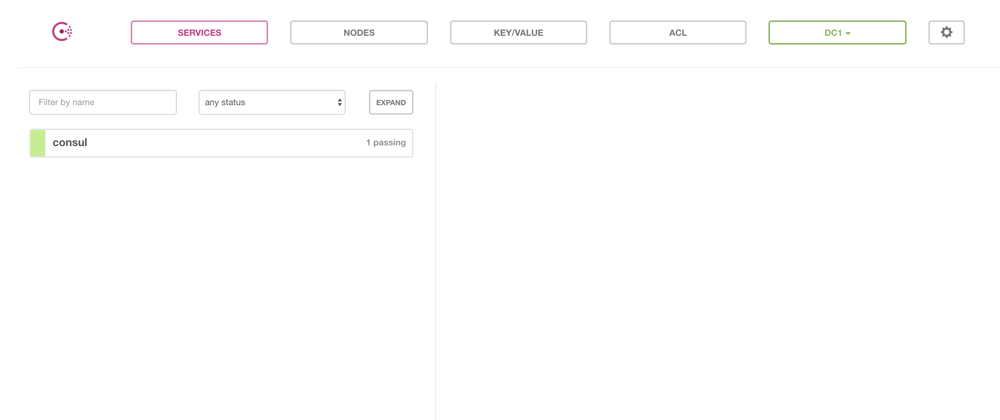
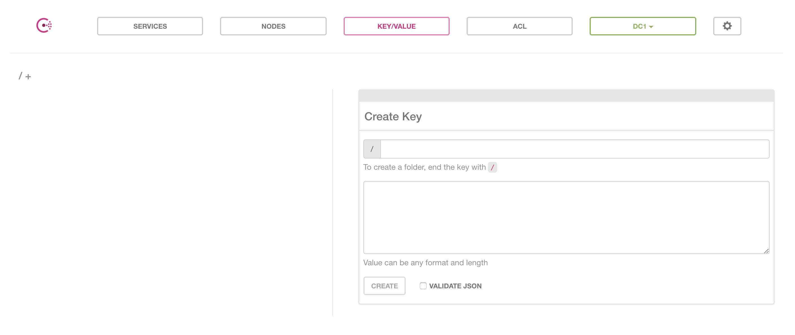
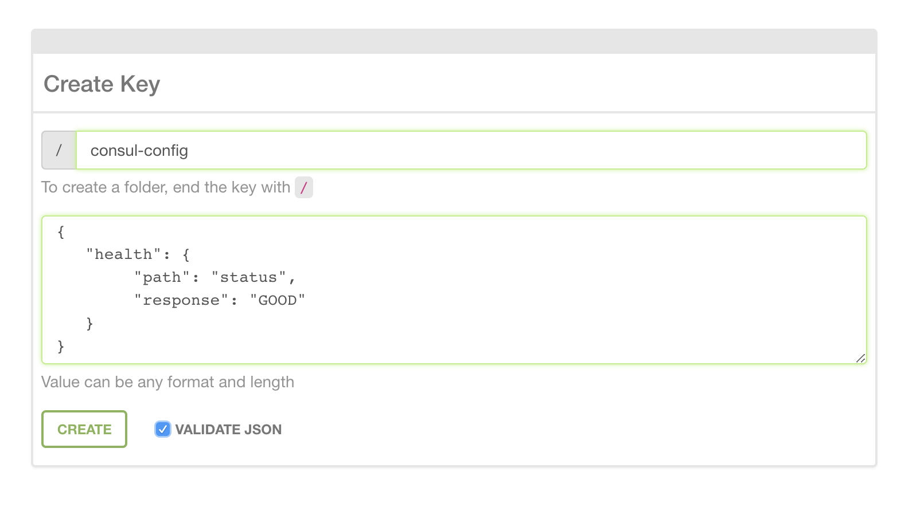
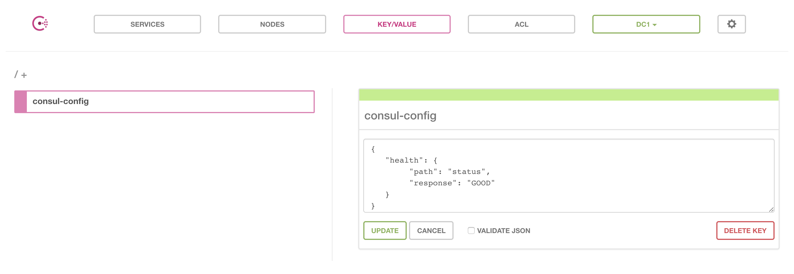

# Dynamic Config

A dynamic configuration library for Node.js written in TypeScript.

### Plugable

Dynamic Config has plugable support for remote config sources and local file types. The library ships with plugins for some common use cases. The supported file types are `.js`, `.yml`, `.ts` and `.json`. It also ships with resolvers for pulling configs from environment variables, command line arguments and remote config values stored in Hashicorp Consul and Vault.

The use of remote configuration is optional. At least one local configuration file (`default.(json|yml|js|ts...)`) is required.

### Promise-based

When requesting a value from Dynamic Config a Promise of the expected result is returned. If the value is found the Promise is resolved. If the value is not found, either because it is missing or some other error, the Promise is rejected with an error describing why the value may be missing.

## Getting Started

Dynamic Config is highly flexible to a number of situations, but I think it's important to walk through a simple application of Dynamic Config.

We're just going to standup an express server that returns a string, but we are going to configure this application for a number of different environments.

### Make a New Project

```sh
$ mkdir config-example
$ cd config-example
$ npm init
```

#### TSCONFIG

My tsconfig.json looks like this:

```json
{
    "compilerOptions": {
        "target": "es6",
        "module": "commonjs",
        "rootDir": "./src",
        "outDir": "./dist",
        "noEmitOnError": true,
        "strict": true,
        "noUnusedLocals": true,
        "pretty": true,
        "removeComments": true
    },
    "exclude": [
        "node_modules",
        "dist"
    ]
}
```

#### PACKAGE.JSON

I add a script to `package.json` to run `tsc` for me.

```json
{
    //...
    "scripts": {
        "build": "tsc"
    },
    //...
}
```

### Install

Install Dynamic Config:

```sh
$ npm install --save @creditkarma/dynamic-config
```

We need to install a few other goodies. In the example we are going to use TypeScript.

```sh
$ npm install --save-dev typescript
$ npm install --save express
$ npm install --save @types/express
```

### Create the Default Config

As mentioned, a default config file is required. If you're doing something simple this may be enough. I'm going to create a new directory at my project root called `config`. Inside of this directory I'm going to create one file `default.json`.

```json
{
    "server": {
        "port": 8000,
        "host": "localhost"
    },
    "health": {
        "path": "control",
        "response": "success"
    }
}
```

### Create an Express Server

I'm going to create one more directory called `src` and in this directory I will add one file `index.ts`.

```typescript
import { config } from '@creditkarma/dynamic-config'
import * as express from 'express'

interface HealthCheckConfig {
    path: string
    response: string
}

(async function startServer() {
    const port: number = await config().get('server.port')
    const healthCheck: HealthCheckConfig = await config().get('health')
    const app: express.Application = express()

    app.get(`/${healthCheck.path}`, (req, res) => {
        res.send(healthCheck.response)
    })

    app.listen(port, () => {
        console.log(`Express server listening on port: ${port}`)
    })
}())
```

That's all we need for the most basic usage of Dynamic Config.

### Running Our Application

Compile TypeScript and run the app:

```sh
$ npm run build
$ node dist/index.js
```

Now you should be able to `curl` the running server:

```sh
$ curl http://localhost:8000/control
```

If all is well this should return "success" as defined in our `config/default.json` file.

### Environment Overrides

One of the main reasons to use a configuration library is to add a layer of abstraction for dealing with environment-specific configuration.

Environmnet-specific configuration files have the same name as the environment they configure. We are going to create a new file for the `development` environment. That means our file must be named "development". Just because we can, instead of `json` we are going to use a `js` file to hold our `development` configuration.

Create a new file called `development.js` in our `config` directory.

```js
module.exports.server = {
    port: 8080
}
```

Now we can run our server in the `development` environment with overrides.

```sh
$ NODE_ENV=development node dist/index.js
```

Now instead of port `8000` we are going to send a request of `8080`.

```sh
$ curl http://localhost:8080/control
```

### Remote Configuration

Things get a little more complex when we talk about pulling in remote configuration and merging it with our local configuration in a seamless way. For this next bit we are going to use Consul running in a Docker container to serve as our remote configuration source.

#### Setting Up Consul with Docker

I am going to use `docker-compose` to configure and run my Consul instance. If you don't have `docker` installed locally, you can check out install instructions [here](https://docs.docker.com/compose/install/).

I add a new file at my project root `docker-compose.yml`:

```yml
version: '2'
services:
  consul:
    image: consul:latest
    volumes:
      - $PWD/consuldata:/tmp/consuldata
    ports:
      - "8410:8400"
      - "8510:8500"
      - "8610:8600"
    environment:
      - "CONSUL_LOCAL_CONFIG={\"disable_update_check\": true}"
      - "CONSUL_BIND_INTERFACE=eth0"
    command: "consul agent -dev -client 0.0.0.0 -server -data-dir=/tmp/consuldata -bootstrap-expect=1"
```

Once we have this open a new terminal window and start Consul by typing:

```sh
$ docker-compose up
```

You will see some logging and very soon:

```sh
consul_1  | ==> Consul agent running!
```

Now we're ready to add some values to our Consul data store. There is an HTTP API for adding values to Consul, but for our purposes we are going to use the UI. The Consul UI can be found at `http://localhost:8510/ui/`.

You should see something like this:



Click on the tab `KEY/VALUE`:



This will work our `development` override. We are going to add a JSON structure that will overlay our local config values. In the top text input we will add the key name `consul-config`. In the larger text box we include a blob of valid JSON (You will notice the built-in JSON validator).

```json
{
    "health": {
        "path": "status",
        "response": "GOOD"
    }
}
```



Click `CREATE` and we are ready to go.



#### Configuring Our Application to Use Consul

In order for Dynamic Config to know about the values we added to Consul we must configure it to know about Consul. We can do this in a couple of ways. We can set configuration on environment variables or we can pass in command line arguments to our application. We are going to use command line arguments.

```sh
$ node ./dist/index.js CONSUL_ADDRESS=http://localhost:8510 CONSUL_KV_DC=dc1 CONSUL_KEYS=consul-config
```

The three options we set are (all are required):
* `CONSUL_ADDRESS` - This is the URL on which Consul is running
* `CONSUL_KV_DC` - The Consul data center for the key/value store.
* `CONSUL_KEYS` - These are keys in Consul that contain configs to overlay with our local configs. This can be a comma-separate list of multiple keys. You will notice I add the key we just created in Consul.

Now when we `curl` our running application we can not longer hit `/control` as we have overriden the path in Consul to `/status`.

```sh
$ curl http://localhost:8080/status
```

The response now should be `GOOD`.
